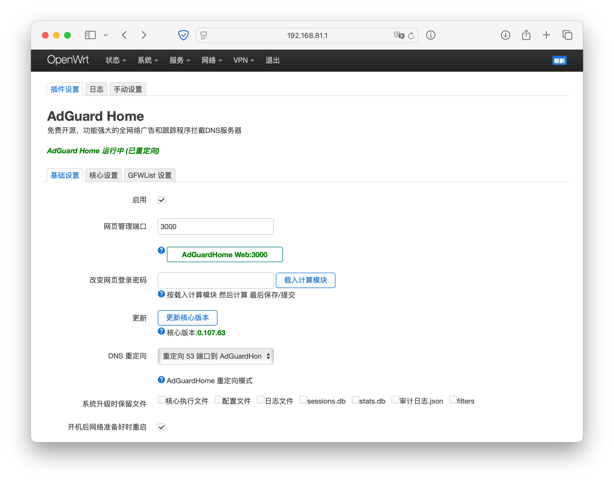
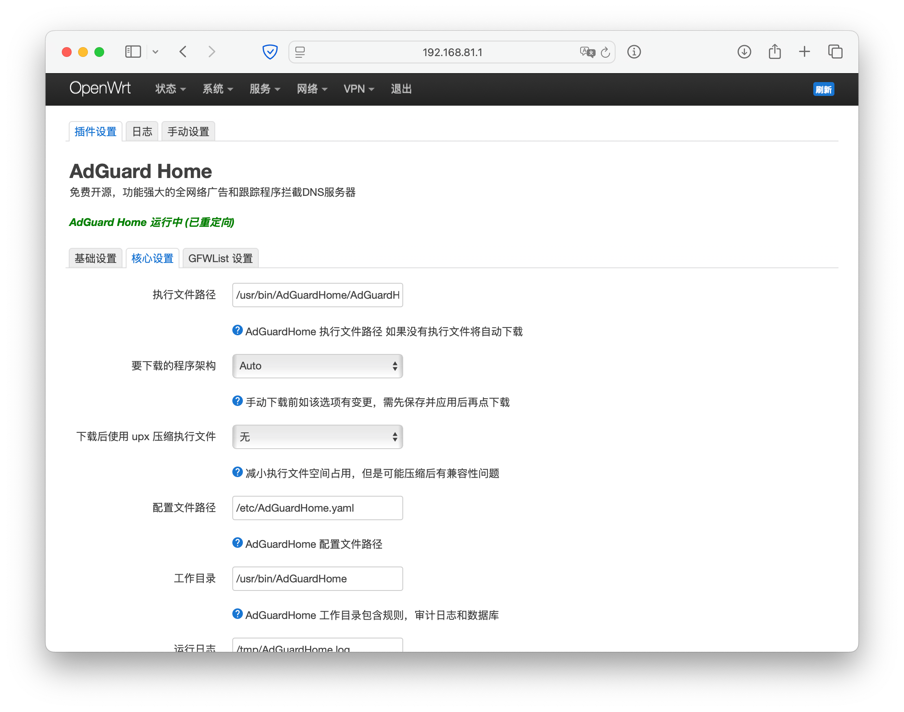
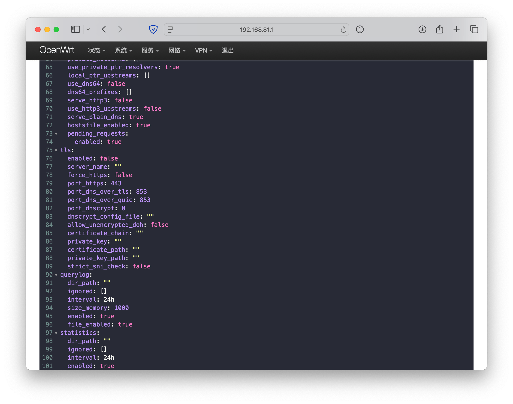
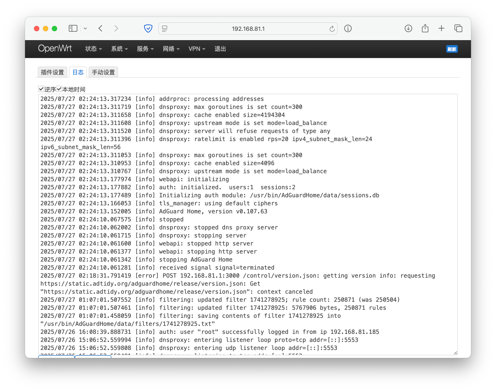

# LuCI App AdGuard Home

先进的 OpenWrt AdGuard Home LuCI 界面应用

## 功能特点

- 支持管理 AdGuard Home 的服务端口
- 在 LuCI 界面中下载/更新核心（支持自定义 URL 下载）
  - 对于 `.tar.gz` 文件，其文件结构需要与官方保持一致
  - 或者直接使用主程序二进制文件
- 使用 `upx` 压缩核心（依赖 `xz`，脚本会自动下载，如果 `opkg` 源无法连接，请在编译时包含此软件包）
- DNS 重定向方式：
  - 作为 `dnsmasq` 的上游（AdGuard Home 统计中 IP 会显示为 `127.0.0.1`，无法跟踪客户端并相应调整设置）
  - 将 53 端口重定向到 AdGuard Home（直接使用系统防火墙设置，对 nftables 兼容更好，且支持 IPv6 重定向）
  - 用 53 端口替换 `dnsmasq`（需设置 AdGuard Home 参数 `dnsip` 为 `0.0.0.0`，`dnsmasq` 和 AdGuard Home 的端口将被交换）
- 自定义选项：
  - 自定义可执行文件路径（支持 `/tmp`，重启后自动重新下载）
  - 自定义配置文件路径
  - 自定义工作目录
  - 自定义运行日志路径
- GFWList 查询特定 DNS 服务器。另可参考 [luci-app-autoipsetadder](https://github.com/rufengsuixing/luci-app-autoipsetadder)
- 支持修改 AdGuard Home 服务登录密码
- 正序/倒序查看/删除/备份每 3 秒更新的运行日志 + 本地浏览器时区转换
- 支持手动修改 AdGuard Home 配置：
  - 支持 YAML 编辑器
  - 提供快速配置模板
- 系统升级时保留勾选文件
- 开机启动后等待网络连接自动重启 AdGuard Home（3 分钟超时，主要防止过滤器更新失败）
- 关机时备份勾选的工作目录中的文件（注意：IPK 更新时也会触发备份）
- 计划任务（以下为默认值，时间和参数可在计划任务中调整）：
  - 自动更新核心（谨慎使用）- 每天 `3:30`
  - 自动截断查询日志（每小时，限制为 2000 行）
  - 自动截断运行日志（每天 `3:30`，限制为 2000 行）
  - 自动更新 IPv6 主机并重启 AdGuard Home（每小时，无更新则不重启）
  - 自动更新 GFW 列表并重启 AdGuard Home（每天 `3:30`，无更新则不重启）

## 已知问题

- `db` 数据库不能放在不支持 `mmap` 的文件系统，如 `jffs2` 和 `data-stk-oo`，请修改工作目录；若检测到 `jffs2`，本插件会自动将数据库软链接到 `/tmp`，但重启后将丢失 DNS 数据库
- 如发现大量来自 `127.0.0.1` 的 localhost 查询，问题原因可能是 DDNS 插件。如不使用 DDNS，请移除或注释 `/etc/hotplug.d/iface/95-ddns`。对于其他来自本地机器的异常查询，高级用户可使用 [kmod-plog-port](https://github.com/rufengsuixing/kmod-plog-port) 进行诊断

## 使用方法

- 下载发布版，用 `opkg` 安装
- 或在编译 OpenWrt 时，将代码克隆到软件包路径并设为 `y` 或 `m`

## 关于压缩

本插件支持通过 `upx` 压缩 AdGuard Home 可执行文件，便于在存储受限的设备上运行。经过对实际的可执行文件进行测试，在使用 `-1` 参数（快速压缩）进行压缩时，耗时 2 秒，压缩率 42%；在使用 `--ultra-brute` 参数（尝试更多不同压缩手段）进行压缩时，耗时 660 秒，压缩率 23%。  
需要注意，如果文件系统本来就支持压缩，例如 `jffs2`，则使用 `upx` 压缩能进一步节省的空间占用会有限。  
此外，压缩是用 RAM 换取 ROM 空间，在运行时会消耗更多的内存。

## OpenClash 组合方法

1. **GFW 代理**：DNS 重定向 - 作为 `dnsmasq` 的上游服务器
2. **GFW 代理**：手动设置 AdGuard Home 上游 DNS 为 `127.0.0.1:[监听端口]`，然后使用 DNS 重定向 - 用 53 端口替换 `dnsmasq`（端口交换后，`dnsmasq` 成为上游）
3. **国外 IP 代理**：任何重定向方法 - 将 GFW 列表添加到 AdGuard Home，启用计划任务定期更新 GFW
4. **GFW 代理**：DNS 重定向 - 将 53 端口重定向到 AdGuard Home，设置 AdGuard Home 上游 DNS 为 `127.0.0.1:53`

## 截图

中文界面示例：  

