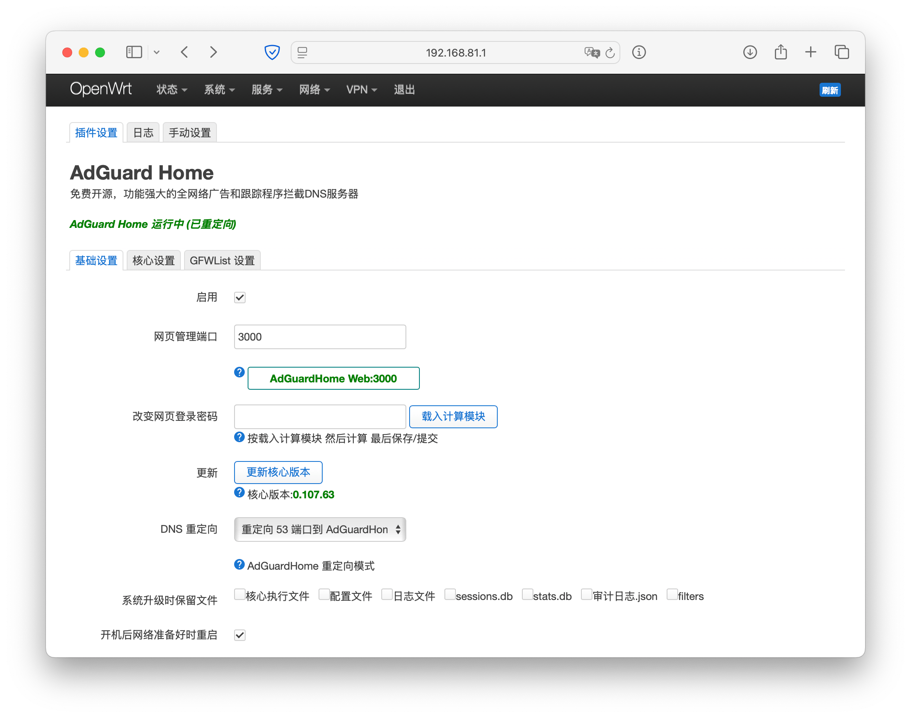
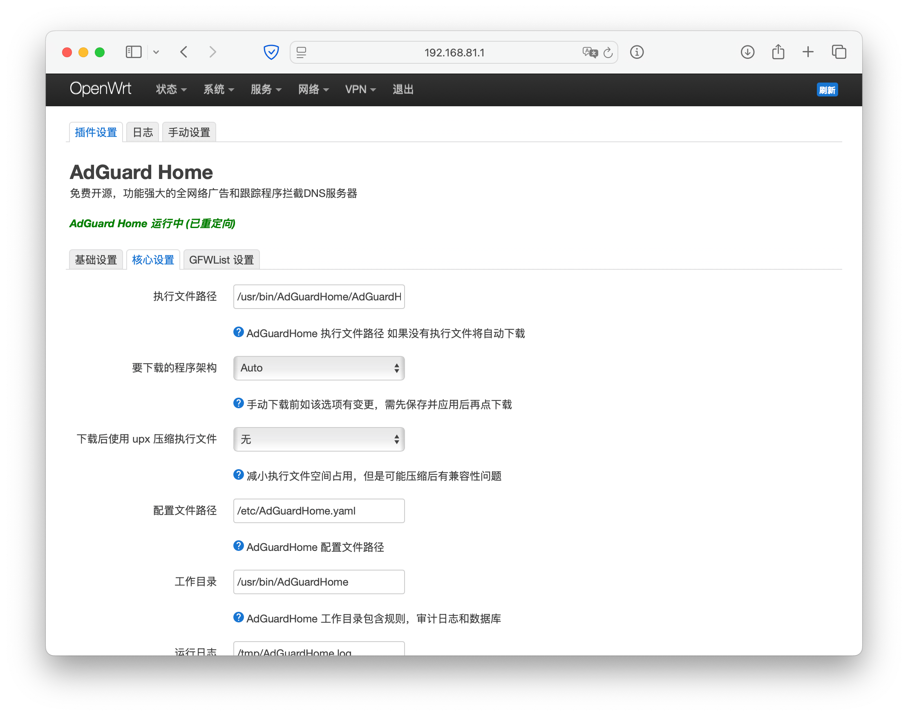
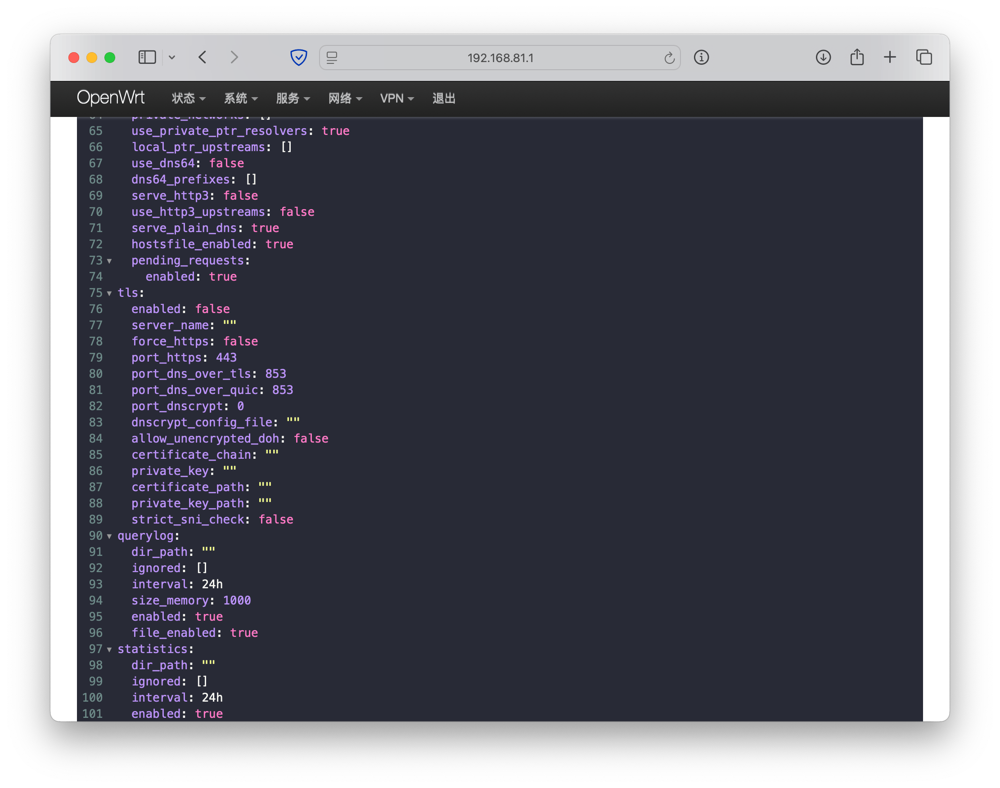
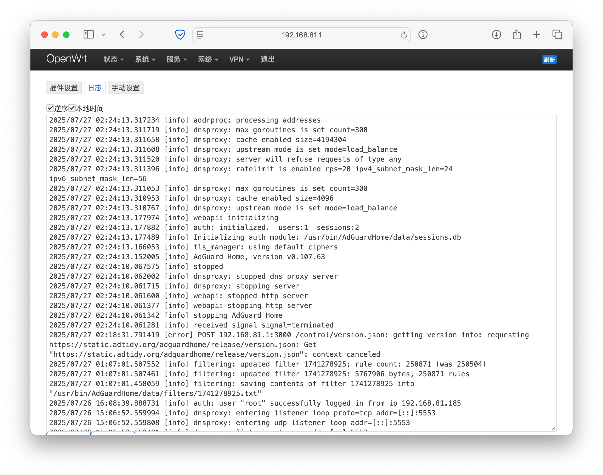

# LuCI App AdGuard Home

Advanced OpenWrt LuCI app for AdGuard Home

[中文 README](README.CN.md)

Download `.ipk` and `.apk` from [Releases](https://github.com/stevenjoezhang/luci-app-adguardhome/releases)

## Features

- AdGuard Home service port management
- Download/update core in LuCI interface (supports custom URL download)
  - For `.tar.gz` files, the file structure must match the official one
  - Or directly use the main program binary
- Compress core with `upx` (`xz` dependency, the script will auto download if needed. If `opkg` source can't connect, please include this package during compilation)
- DNS redirection methods:
  - As the upstream of `dnsmasq` (IP in AdGuard Home statistics will show as `127.0.0.1`, unable to track clients and adjust settings accordingly)
  - Redirect port 53 to AdGuard Home (Directly using the system firewall settings, offers better compatibility with `nftables` and also supports IPv6 redirection)
  - Replace `dnsmasq` with port 53 (needs AdGuard Home configuration with `dnsip=0.0.0.0`, ports of `dnsmasq` and AdGuard Home will be exchanged)
- Customization options:
  - Customize executable file path (supports `/tmp`, auto redownload after reboot)
  - Customize config file path
  - Customize work directory
  - Customize runtime log path
- GFWList query to specific DNS server. Also check out [luci-app-autoipsetadder](https://github.com/rufengsuixing/luci-app-autoipsetadder)
- Modify AdGuard Home login password
- View/delete/backup runtime log in positive/reverse order with 3-second updates + local browser timezone conversion
- Manual configuration:
  - YAML editor support
  - Templates for fast configuration
- File preservation during system upgrades
- Waits for network access at boot (3min timeout, mainly to prevent filter update failure)
- Workdir backup on shutdown (Note: backup also triggers during IPK updates)
- Scheduled tasks (default values, time and parameters adjustable in scheduler):
  - Auto truncate query log (hourly, limit to 2000 lines)
  - Auto truncate runtime log (`3:30/day`, limit to 2000 lines)
  - Auto update IPv6 hosts and restart AdGuard Home (hourly, no restart if no updates)
  - Auto update GFW list and restart AdGuard Home (`3:30/day`, no restart if no updates)

## Known Issues

- Database doesn't support filesystems that don't support `mmap` (such as `jffs2` and `data-stk-oo`). Please modify work directory; if `jffs2` is detected, the app will automatically create soft links (`ln`) for the databases to `/tmp`, but DNS database will be lost after reboot
- If you find many localhost queries from `127.0.0.1`, the DDNS plugin might be the cause. If you don't use DDNS, please remove or comment out `/etc/hotplug.d/iface/95-ddns`. For other abnormal queries from the local machine, advanced users can use [kmod-plog-port](https://github.com/rufengsuixing/kmod-plog-port) to diagnose

## Usage

- Download release and install with `opkg`
- Or when building OpenWrt, clone the code to package path and set as `y` or `m`

## About Compression

The plugin supports compressing the AdGuard Home executable with `upx`, which is useful for devices with limited storage. Testing shows that using the `-1` parameter (Compress faster) takes 2 seconds and achieves a 42% compression rate, while using `--ultra-brute` (Try even more compression variants) takes 660 seconds and achieves a 23% compression rate.  
Note that if the filesystem already supports compression (like `jffs2`), using `upx` may not save much space.  
Also, compression trades RAM for ROM space, which consumes more memory during runtime.

## OpenClash Combination Methods

1. **GFW Proxy**: DNS redirect - as `dnsmasq`'s upstream server
2. **GFW Proxy**: Manually set AdGuard Home upstream DNS to `127.0.0.1:[your listening port]`, then use DNS redirect - use port 53 to replace `dnsmasq` (after port exchange, `dnsmasq` becomes the upstream)
3. **Foreign IP Proxy**: Any redirect method - add GFW list to AdGuard Home, enable scheduled task to update GFW regularly
4. **GFW Proxy**: DNS redirect - redirect port 53 to AdGuard Home, set AdGuard Home upstream DNS to `127.0.0.1:53`

## Screenshots

Example in zh-cn:  

